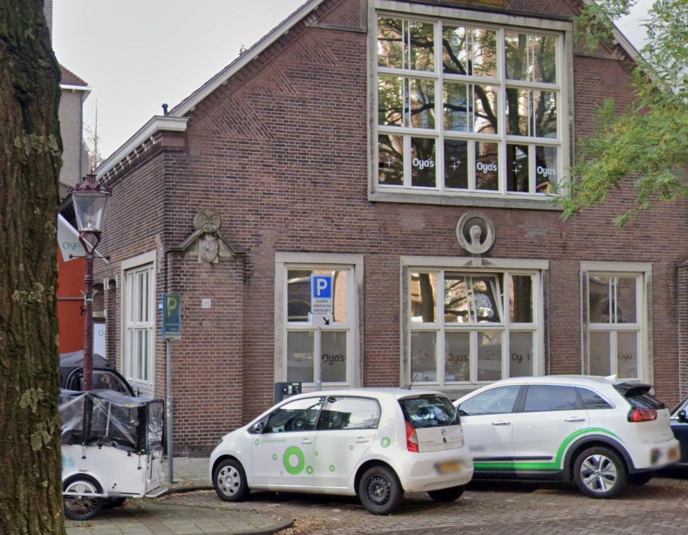

# Church Chasing

Difficulty: Easy

## Challenge

When I was overseas I visited a nice church, but I can’t remember what it was called. To make it worse, the only picture I have is this photo I took nearby. 

Can you find the name of the nearest church to this location? 

Write the flag as `FLAG{name_of_church}`

---

Solution

The car has the logo and brand name for “greenwheels”, an electric car share company based in the Netherlands. 

The building has “Oyas” on the windows. Searching “Oyas Netherlands” returns results for “Oya’s childcare”. 

There are very few locations for Oya’s childcare, which can be used to find the church just out of frame.

Flags: 
- `obrechtkerk`

