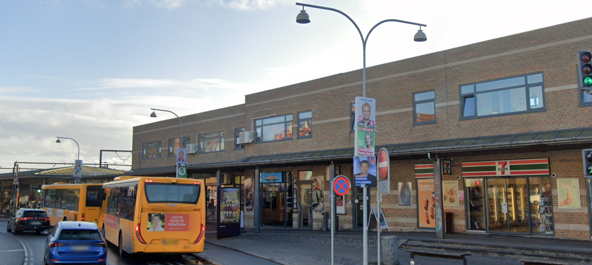

# Obusessed

Difficulty: Hard

## Challenge

While on holiday I really enjoyed riding that furthest left bus in this image. Some would call me obsessed, but I’d love to know the day the vehicle was registered (YYYY-MM-DD), and which company its insured with (in English or not). 

Write the flag as `FLAG{YYYY-MM-DD_company_name}`, eg: `FLAG{024-01-31_insurance_guys}`

---

Solution

The bottom political poster is of Rasmus Hylleberg, a political candidate for the Roskilde constituency. 

We can see a 7/11 in the image, of which there are very few in Roskilde (in fact googling Roskilde 7/11 should show this exact one first).

From there we can go into google maps, head to this location and see the buses. 

Moving closer, we can see the first has the word `ditobus` and the number `4646` on it. Googling `ditobus 4646` will return data on that specific bus, such as chassis, registration date, and registration number (`UY89703`)

From there, you can look up a vehicle’s registration number on websites like https://motorregister.skat.dk/ or https://www.altombilen.dk/koeretoej/UY89703/7547486 which have sections for insurance information.

Flags: 
- `2007-02-12_GJENSIDIGE_FORSIKRING`
- `2007-02-12_Mutual_Insurance`

